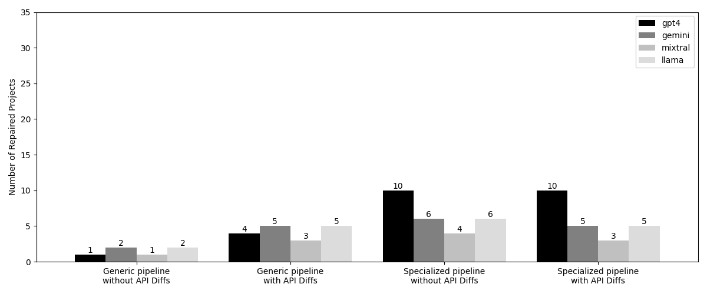

# Automatic Program Repair For Breaking Dependency Updates With Large Language Models
Author: [Federico Bono](https://www.github.com/FredBonux)  
Supervisors: Frank Reyes García, Italo Tonon  
Examiner: Martin Monperrus
## Abstract

External libraries are widely used to expedite software development, but like any software component, they are updated
over time, introducing new features and deprecating or removing old ones. When a library introduces breaking changes,
all its clients must be updated to avoid disruptions. This update, when it introduces a breaking change, is defined as a
Breaking Dependency Update. Repairing such breakages is challenging and time-consuming because the error originates in
the dependency, while the fix must be applied to the client codebase.

Automatic Program Repair (APR) is a research area focused on developing techniques to repair code failures without human
intervention. With the advent of Large Language Models (LLMs), learning-based APR techniques have significantly improved
in software repair tasks. However, their effectiveness on Breaking Dependency Updates remains unexplored.

This thesis aims to investigate the efficacy of an LLM-based APR approach to Breaking Dependency Updates and to examine
the impact of different components on the model’s performance and efficiency. The focus is on the API differences
between the old and new versions of the dependency and a set of error-type specific repair strategies. Experiments
conducted on a subset of BUMP, a new benchmark for Breaking Dependency Updates, with a strong focus on build failures,
demonstrate that a naive approach to these client breakages is insufficient. Additional context from the dependency
changes is necessary. Furthermore, error-type specific repair strategies are essential to repair some blocking failures
that prevent the tool from completely repairing the projects. Finally, our research found that GPT-4, Gemini, and Llama
exhibit similar efficacy levels but differ significantly in cost-efficiency, with GPT-4 having the highest cost per
repaired failure among the tested models, almost 30 times higher than Gemini.

## Repository Contents

- 📁 **benchmarks/**: Configuration scripts and base directory for benchmark files
- 📁 **libs/**: Source code of the tools used to do Fault Location (FL) and context extraction (API Diffs)
- 📁 **pipeline/**: Source code for the APR pipelines
- 📁 **prompts/**: Prompt templates used in the different pipeline configurations
- 📊 **results/**: Experimental results and analysis.


- ⚙️ **benchmark.py**: Python script to run a specific benchmark configuration
- ️⚙️ **main.py**: Debug Python script to run a specific project
- ️⚙️ **replay.py**: Python script to generate patched version of a client from a result file


- ️⚡ **run_experiments.bash**: Bash script to run **sequentially** all the experiments
- ️⚡ **run_experiments-parallel.bash**: Bash script to run **in parallel** all the experiments
- 🎛️ **setup.bash**: Setup script to clone the benchmark repository and perform dataset selection
- 📄 **README.md**: This file.

## Setup and Installation

To set up the project locally, follow these steps:

1. Clone the repository:
    ```sh
    git clone https://github.com/chains-project/bumper.git
    cd bumper
    ```

2. Create and activate a virtual environment:
    ```sh
    python -m venv venv
    source venv/bin/activate  # On Windows, use `venv\Scripts\activate`
    ```

3. Install the required dependencies:
    ```sh
    pip install -r requirements.txt
    ```

4. Setup benchmarks dataset:
   ```shell
   bash setup.bash
   ```

5. Setup environment variable:
   ```shell
   cp .env.example .env
   ```
   
6. **To use Gemini you need to store the Google Cloud API Credential `(g_credentials.json)` in the root folder of the project**:

## Usage

### Run all the experiments

1. To run the complete experiment set in sequence:
    ```sh
    bash run_experiments.bash :name
    ```

2. Or to run the complete experiment set in parallel (4 processes max):
   ```sh
    bash run_experiments-parallel.bash :name
    ```

### Run a specific experiment

To run a specific experiment you can use the `benchmark.py` script with the needed flags.

 ```sh
 [RUN_ID=:id] [WITHOUT_APIDIFF=True] python benchmark.py -n :name -p :pipeline -m :model
 ```

**IMPORTANT:** To run multiple experiments in parallel remember to set the `RUN_ID` env variable to identify the
specific execution and avoid collisions in the repair process

## Results

The results of our experiments can be found in the `results` directory. 
A complete data analysis with chart is provided in the [analysis](results%2Fanalysis.ipynb) Jupyter notebook 
Key findings include:

- The necessity of incorporating additional context from dependency changes.
- The importance of error-type specific repair strategies.
- Comparative analysis of GPT-4, Gemini, and Llama in terms of efficacy and cost-efficiency.



## Contributing

Contributions are welcome! Please submit a pull request or open an issue to discuss your ideas or suggestions.

## Contact

For any questions or inquiries, please contact [fbono@kth.se](mailto:fbono@kth.se).
